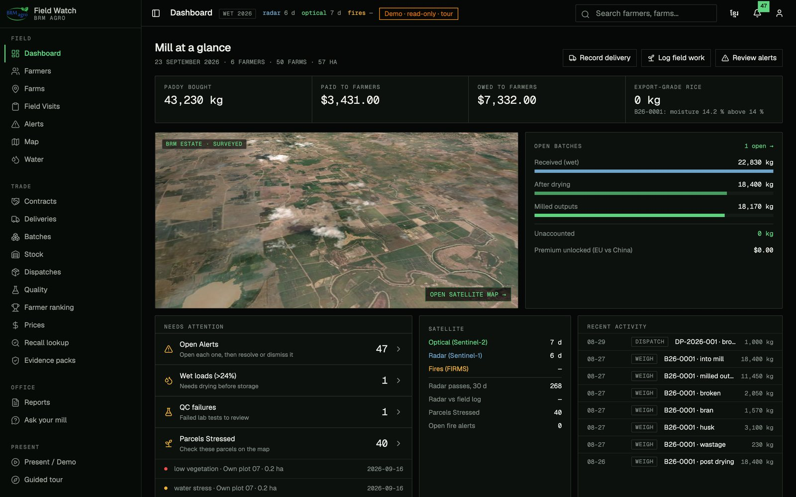
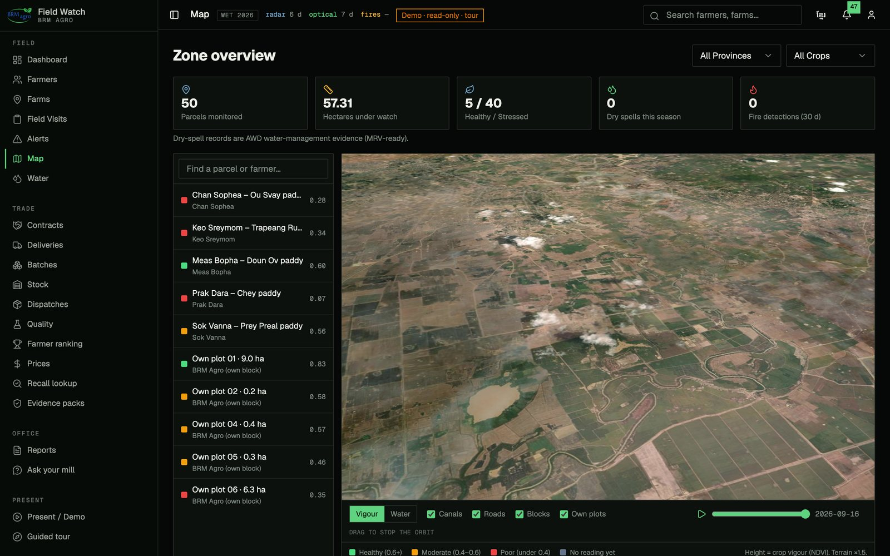
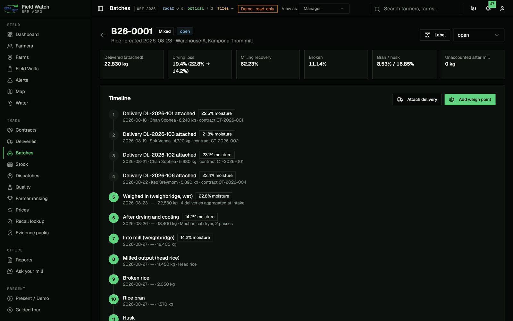
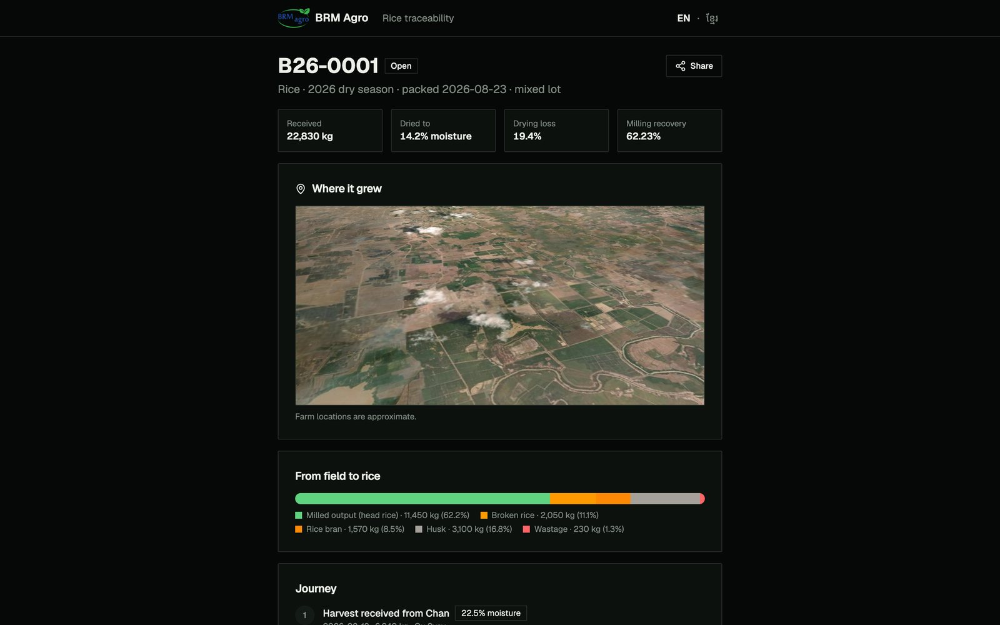
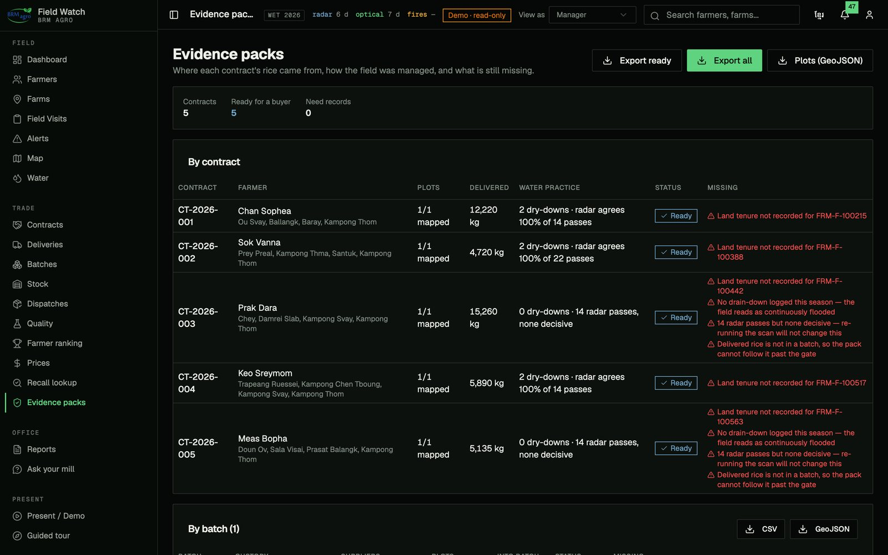
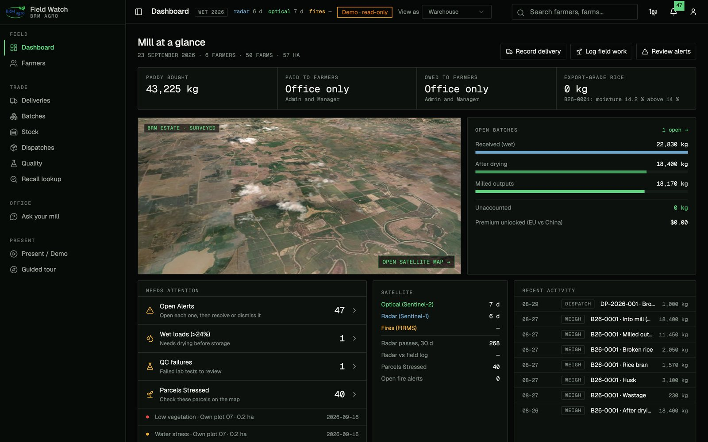
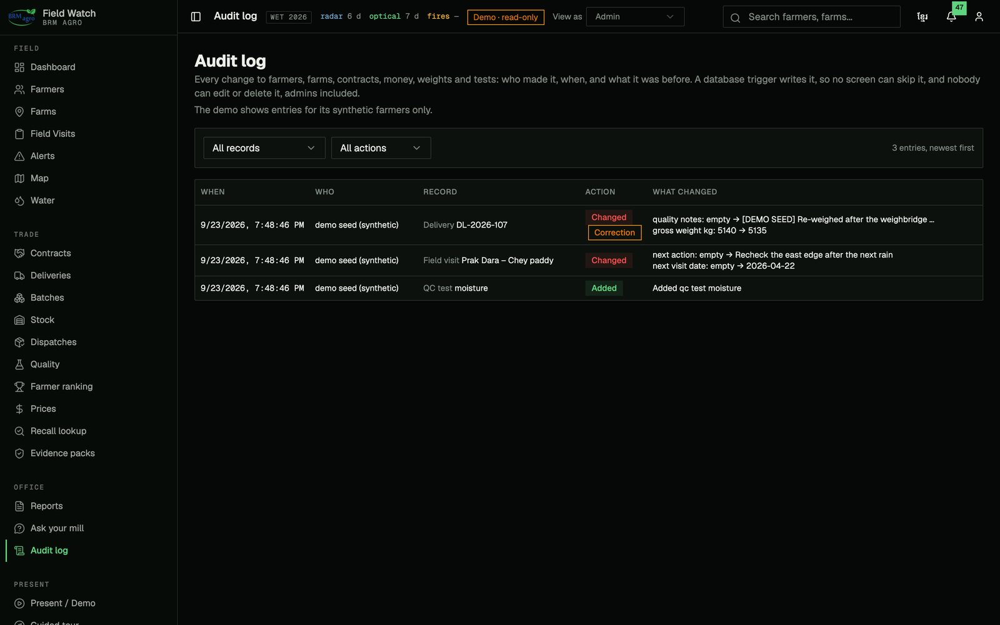
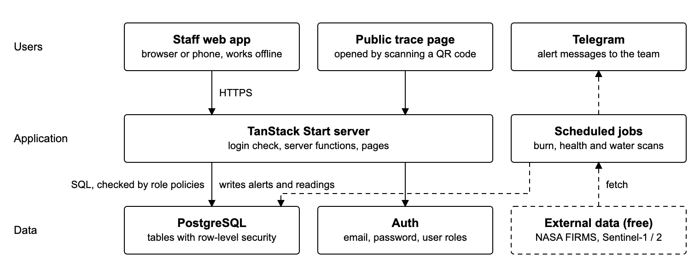
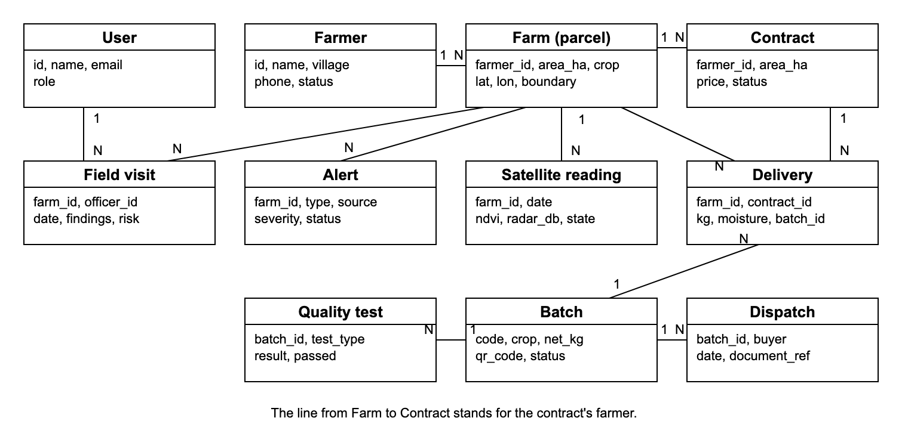
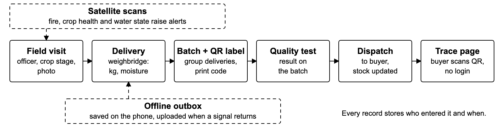

# Field Watch

**Farmer monitoring and rice traceability for a Cambodian rice mill.**
Free satellite data watches every contracted parcel between field visits, every kilogram is weighed from the farm gate to the milled lot, and each batch gets a QR code that opens a public trace page.

[](https://github.com/mrjameskongg/field-watch/actions/workflows/ci.yml)

| | |
|---|---|
| **Live demo** (one click, read-only) | https://fieldwatch.live/login?demo=1 |
| **Public trace page** (no login, what a buyer sees after scanning a bag) | https://fieldwatch.live/trace/B26-0001 |
| **How it is engineered** (public) | https://fieldwatch.live/system |

The demo signs in as `demo@fieldwatch.live`. That account is read-only at the database layer and only sees synthetic demo farmers, so it is safe to click anything.



---

## Contents

1. [The problem](#the-problem)
2. [What Field Watch does](#what-field-watch-does)
3. [Try it in five minutes](#try-it-in-five-minutes)
4. [Proposal vs. delivered](#proposal-vs-delivered)
5. [Architecture](#architecture)
6. [Security model](#security-model)
7. [Satellite pipeline](#satellite-pipeline)
8. [Offline capture](#offline-capture)
9. [Tech stack](#tech-stack)
10. [Run it locally](#run-it-locally)
11. [Tests and CI](#tests-and-ci)
12. [Data and privacy](#data-and-privacy)
13. [Known limits](#known-limits)
14. [Team and history](#team-and-history)

---

## The problem

BRM Agro, the partner mill, buys paddy from contracted smallholders around Kampong Thom, Cambodia. Before Field Watch its field records were paper visit forms and an Excel workbook, and nothing about a farm travelled with the paddy to the mill.

- A field officer reaches each farm about once a month, so burning, flooding and crop stress in between go unseen.
- Once paddy from several farms is mixed into one batch, the link back to the parcels is lost.
- European buyers pay a premium only for rice that can be traced from farm to buyer.
- Field officers work where there is no mobile signal.

**Question:** how can a mill monitor hundreds of dispersed farms and prove the origin and quality of its rice, without an officer on every parcel every week?

## What Field Watch does

| Area | What it does | Where |
|---|---|---|
| Farmer file | One page per farmer: biodata, parcels, contract, advances, deliveries, payments, documents | `/farmers`, `/farmers/:id` |
| Parcels and map | GPS point and drawn boundary per parcel; 3D satellite estate map coloured by crop vigour or water state; overlap check between parcels | `/farms`, `/map` |
| Field work | Visits, crop cycles, AWD water log (flooded / drained events with tube readings) | `/visits`, `/farms/:id`, `/water` |
| Satellite watch | Fire hotspots (NASA FIRMS), crop vigour (Sentinel-2 NDVI), water state through cloud (Sentinel-1 radar); one alert per event | `/alerts`, `/map`, `/water` |
| Contracts and money | Contract terms, input advances (seed, fertiliser, diesel), settlement wizard that nets advances off the delivery value, printable slip | `/contracts`, `/contracts/:id` |
| Intake and quality | Weighbridge intake with moisture flag, QC tests, a moisture test required before a load can be paid | `/deliveries`, `/qc` |
| Mill chain | Batches with weigh points at every stage (wet, dried, into mill, milled outputs); drying loss and milling recovery measured, not assumed; stock on hand; dispatch to buyer | `/batches`, `/stock`, `/dispatches` |
| Traceability | QR per batch, public trace page, two-way recall lookup (lot to farms, farm to lots) | `/trace/:code`, `/recall` |
| Reports | Farmer ranking (fulfilment 50, quality 30, clean record 20), contract and delivery reports, EUDR-format evidence packs (GeoJSON, CSV, WKT) | `/ranking`, `/reports`, `/compliance` |
| Ask | Plain-language questions in English or Khmer, answered from the mill's own data under the asker's own permissions | `/ask` |

| | |
|---|---|
|  |  |
| **Map.** Surveyed estate on Sentinel-2 imagery, parcels coloured by NDVI. | **Batch.** Every weigh point from wet paddy to milled outputs; nothing unaccounted. |
|  |  |
| **Trace page.** Public, no login, no personal data. | **Evidence packs.** Per contract: parcels mapped, water practice, what is still missing. |
|  |  |
| **Viewed as Warehouse.** Money is "Office only" and the menu is intake, batches, stock and dispatch. | **Audit log.** Who changed what, from what, to what. Corrections to posted facts are flagged. |

## Try it in five minutes

1. Open https://fieldwatch.live/login?demo=1. It signs in and starts a five-stop guided tour.
2. **Dashboard:** paddy bought, paid and owed, the open batch and what needs attention.
3. **Map:** drag to orbit the estate. Toggle *Vigour* / *Water*. Drag the date scrubber to replay the season.
4. **Contracts → CT-2026-001:** the farmer chain from registration to payment. Advances ($235.00) were netted off two loads ($3,666.00), so the farmer was paid $3,431.00.
5. **Batches → B26-0001:** four loads from three farms, dried and milled. Every kilogram is accounted for at each stage.
6. **Public trace:** open https://fieldwatch.live/trace/B26-0001 in a private window. That is what a buyer sees after scanning the QR code.
7. **Ask your mill:** try *"Which deliveries failed a moisture test?"*
8. **Roles:** in the header, switch **View as** to *Warehouse*. The menu shrinks, and on CT-2026-001 the settlement and advances disappear, because the database refuses them to that role. Switch to *Admin* and open **Audit log**: every change, with before and after.

A longer walkthrough with what to look for on each screen is in [docs/DEMO.md](docs/DEMO.md).

## Proposal vs. delivered

Status against the objectives in the project proposal (4 September 2026).

| # | Objective | Status | Evidence |
|---|---|---|---|
| 1 | One relational database for farmers, parcels (point + boundary), contracts, advances, visits, deliveries, batches | Done | `supabase/migrations/`; 23 tables, all with row-level security |
| 2 | Five staff roles and a public view, enforced by row-level security in the database; append-only below Admin; every correction logged | Done | Admin, Manager, Field Officer, Warehouse, Quality Officer and the public trace page. Restrictive policies generated from one matrix ([`roles-core.ts`](src/lib/roles-core.ts)), a trigger that lets only an admin correct a posted weight, test or amount, and an audit log on 19 tables. 68 of 68 permission checks pass against the live database ([docs/SECURITY.md](docs/SECURITY.md)). |
| 3 | Scheduled scans for fire, crop stress and water state; one alert per event | Done | `pg_cron` runs the Sentinel-2 health scan weekly and the Sentinel-1 water scan twice a week on the server. The FIRMS fire scan runs once a day from the app when a field or office user opens it, and on demand from the Alerts page; moving it to a server schedule (`supabase/functions/burn-scan`, written, not yet deployed) is the next step. |
| 4 | Delivery → batch → QC → dispatch, QR per batch, public trace page | Done | `/batches/:id`, `supabase/functions/trace`, `src/lib/lot-core.ts` |
| 5 | Record visits, deliveries and tests without a signal | Done for deliveries, QC tests, weigh points and field events | `src/lib/offline-core.ts`, `public/sw.js`, [docs/OFFLINE.md](docs/OFFLINE.md). Visits are not queued yet. |
| 6 | Field trial on about 20 real parcels, measure alert accuracy and hours saved, show a second mill | Not started, scheduled for November per the proposal timeline | |

Beyond the proposal: a "View as" switch on the public demo that shows each role's view as enforced by the database, over-pumping detection from diesel advances vs. radar water state, a radar vs. field-log agreement rate, NDMI water-stress alerts, identity-preserved vs. mass-balance batch custody, USD/KHR money, a read-only demo enforced in the database, and a public engineering page.

## Architecture



*Figure 1. Three tiers. The browser never calls a satellite service directly: scheduled jobs on the server fetch the data and write results into the database, and the app reads them from there.*

- **Browser:** React 19 app (TanStack Start, server-rendered), installable as a PWA, with an IndexedDB outbox for offline capture.
- **Database:** PostgreSQL on Supabase. Permissions live in row-level security policies, not in the UI.
- **Edge functions** (Deno, `supabase/functions/`): `burn-scan`, `health-scan`, `water-scan`, `trace` (public, returns a narrow projection with no personal data), `ask` (runs under the caller's own login, so it can only see what they can see), `settlement-alert`.
- **Scheduler:** `pg_cron` calls the scan functions with a shared secret header.



*Figure 2. Main tables. A batch links back through its deliveries to contracts, farms and the farmer.*



*Figure 3. From field capture to the public trace page, with offline capture and satellite alerts entering the chain.*

## Security model

| Layer | Rule | Where |
|---|---|---|
| Sign-in | Supabase Auth, email and password, JWT | `src/routes/login.tsx` |
| Member gate | An account with no staff role reads and writes nothing, even though sign-up is open | [`20260923120000_member_gate.sql`](supabase/migrations/20260923120000_member_gate.sql) |
| Roles | Five staff roles in `user_roles`. One matrix in `roles-core.ts` generates a restrictive policy per table and action; a test fails if the migration drifts from it | [`roles-core.ts`](src/lib/roles-core.ts), [`20260923140100_roles_audit.sql`](supabase/migrations/20260923140100_roles_audit.sql) |
| Posted facts | Only an admin can change a posted weight, moisture, price, test result or payment amount, and only an admin can delete | `lock_posted_facts` trigger, same migration |
| Audit log | Every insert, update and delete on 19 business tables, with who, when and the old and new values. Admins read it; nobody can write to it through the API | `audit_row` trigger, [`/audit`](src/routes/_authenticated/audit.tsx) |
| Proof | 68 of 68 permission checks pass against the live database, run as a throwaway user per role inside a rolled-back transaction | [`supabase/tests/role_policies.sql`](supabase/tests/role_policies.sql), [docs/SECURITY.md](docs/SECURITY.md) |
| Demo account | Read-only through 66 restrictive policies; sees only farmers on an explicit allowlist, so real farmers stay hidden even as new ones are added. Its "View as" switch sends a header the database honours for the demo account only | [`20260831190000_demo_readonly.sql`](supabase/migrations/20260831190000_demo_readonly.sql), [`20260923130000_demo_sees_seed_only.sql`](supabase/migrations/20260923130000_demo_sees_seed_only.sql) |
| Public trace | Edge function returns batch, weights, parcels (coordinates rounded to about 110 m) and satellite record; never phone, national ID, price or settlement | `supabase/functions/trace/index.ts` |
| Secrets | Satellite and AI keys live only in edge function secrets; nothing secret is shipped to the browser. The key in `.env.example` is Supabase's public anon key, which is safe to publish because every table is behind row-level security. | `.env.example` |

## Satellite pipeline

| Signal | Source | Rule in code |
|---|---|---|
| Fire | NASA FIRMS, VIIRS (Suomi NPP and NOAA-20) | Looks back 2 days over the estate zone. A hotspot belongs to a parcel if it falls inside the boundary or within 1 km of the parcel's GPS point (haversine). Duplicates suppressed by location and date. High severity when VIIRS confidence is high or fire radiative power is above 10 MW. `src/lib/firms-core.ts` |
| Crop stress | Copernicus Sentinel-2 L2A | NDVI = (B08 − B04) / (B08 + B04). Passes over 40% cloud are dropped. `low_vegetation` alert when NDVI falls below 0.8 × the parcel's own 30-day mean **and** below 0.5. `water_stress` when NDMI = (B08 − B11) / (B08 + B11) is below 0.15 (high below 0.05). `src/lib/health-core.ts` |
| Water state | Copernicus Sentinel-1 GRD radar (sees through cloud) | Gamma0, Lee speckle filter, mean over the parcel, converted to dB. VV ≤ −15 dB = flooded, VV ≥ −10 dB = drained, in between = uncertain. VH above −18 dB means closed canopy, so a "drained" reading is marked not confident. Each reading is compared with the farmer's logged water events within ±6 days to give an agreement rate. `src/lib/water-core.ts` |

AWD (alternate wetting and drying) is the practice buyers and carbon programmes ask about. [docs/RESEARCH-SAR-AWD.md](docs/RESEARCH-SAR-AWD.md) reviews the open-source work on detecting it from radar and where this project's field log fits.

## Offline capture

Deliveries, QC tests, batch weigh points and field events can be recorded with no signal. Each record is saved to an IndexedDB outbox with an ID generated on the device, then sent oldest-first when the connection returns. A duplicate-key error counts as success, so re-sending after a dropped connection cannot create a second load of rice. Settlements deliberately need a live connection, because a phone holding yesterday's picture could pay the same load twice. Details: [docs/OFFLINE.md](docs/OFFLINE.md).

## Tech stack

| Layer | Technology |
|---|---|
| Front end | TypeScript 5.8 (strict), React 19, TanStack Start / Router / Query, Tailwind CSS 4, shadcn/ui |
| Maps and charts | MapLibre GL 6 (3D estate map), Leaflet 1.9 (parcel drawing, trace map), Recharts 3 |
| Database and auth | PostgreSQL on Supabase, row-level security, Supabase Auth |
| Server jobs | Supabase Edge Functions (Deno), `pg_cron`, `pg_net` |
| Satellite data | NASA FIRMS, Copernicus Data Space (Sentinel-1, Sentinel-2), all free |
| Offline | Hand-written service worker, IndexedDB outbox, web app manifest |
| Quality | Vitest 4, ESLint 9, GitHub Actions |
| Hosting | Lovable, custom domain fieldwatch.live |

```
src/
  routes/            one file per page (TanStack file routes); _authenticated/* needs a login
  lib/*-core.ts      pure business logic (money, stock, grading, satellite rules), each with a .test.ts
  components/        UI, maps, QR
  integrations/      Supabase client and generated types
supabase/
  migrations/        schema, row-level security, cron schedules
  functions/         edge functions (scans, trace, ask, alerts)
  seed/              synthetic demo data
public/              service worker, manifest, static GeoJSON layers
docs/                offline design, research notes, figures, screenshots
```

## Run it locally

Requires Node 22.

```bash
git clone https://github.com/mrjameskongg/field-watch.git
cd field-watch
cp .env.example .env
npm ci
npm run dev
```

Open http://localhost:8080/login?demo=1. The local app talks to the hosted database with the public anon key, so the read-only demo works out of the box. To run your own backend, create a Supabase project, apply `supabase/migrations/` in order, then optionally `supabase/seed/`.

## Tests and CI

```bash
npm run typecheck   # tsc --noEmit, strict mode
npm run lint        # ESLint
npm test            # Vitest
npm run build       # production build
```

33 test files and 453 tests cover the pure logic in `src/lib`: settlement arithmetic, stock and FIFO milling order, batch mass balance, grading and ranking, satellite thresholds, offline outbox rules, overlap detection, EUDR export, and the role matrix (including a check that the checked-in SQL policies match it). GitHub Actions runs all four steps on every push and pull request.

Database permissions are tested separately against a real database: [`supabase/tests/role_policies.sql`](supabase/tests/role_policies.sql) acts as each role and records what PostgreSQL allowed, then rolls back. Latest run: 68 of 68 passed on production, 23 September 2026 ([results](docs/SECURITY.md#policy-tests)).

After changing roles in `src/lib/roles-core.ts`, run `npm run gen:policies` to regenerate the SQL.

## Data and privacy

- The demo account sees **synthetic** farmers only (FRM-1002xx to FRM-1005xx, plus the mill's own estate block). Field visits, advances, settlements and three example audit entries for them are marked `[DEMO SEED]` or `demo seed (synthetic)` and come from [`supabase/seed/demo-seed-2026-09-23.sql`](supabase/seed/demo-seed-2026-09-23.sql).
- Real contract-farmer records exist in the production database for the partner mill. They are hidden from the demo account by policy and are not in this repository.
- Parcel geometry under `public/geo/` is the mill's own surveyed estate; the live site already serves these files publicly.

## Known limits

- Officers are not yet limited to their own assigned farms.
- The Ask page answers with the signed-in account's real role; in the demo it answers as Manager whatever "View as" says.
- The fire scan depends on someone opening the app each day; its server-side schedule needs one function deployed.
- Khmer strings were machine-drafted and are awaiting native review.
- Price columns are visible to every staff role; hiding them per role needs column-level masking.
- The Sentinel-2 stress rule compares a parcel to its own recent history, not to its crop stage.
- The field trial and its evaluation (objective 6) are scheduled for November.

## Team and history

Class project by **Sovandarapor Kong** and **Yean**, with BRM Agro (Kampong Thom, Cambodia) as the partner mill.

Field Watch started as BRM Agro's internal tool. It was developed from April to September 2026 in a private repository (245 commits), starting from a [Lovable](https://lovable.dev) scaffold, which is where the `@lovable.dev/*` build packages come from. This repository is a clean snapshot of that code with secrets, internal notes and real farmer data removed.

All rights reserved. Published for academic review.
